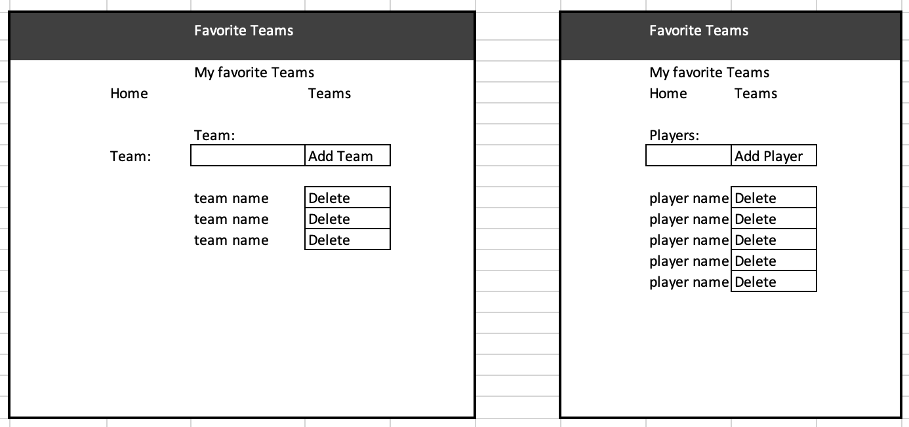
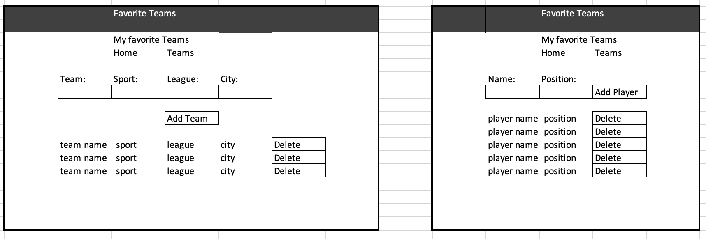

## Deere Project 4

This applicaiton will allow you to list your favorite baseball team(s) and player(s).  You may add or remove teams as the season progresses.  You may add or remove players as trades happen.

This is the front end portion which does the screen navigation and makes the API calls.  The local API URL is 'http://localhost:3000/api/teams'.  The Heroku deployed URL is 'https://favorite-team-frontend.herokuapp.com/'.

## BASIC FLOW
- Click on the navigation link to go to Favorite Team
- Enter the name of your favorite team and click the Add Team button
- click on the team name to go to the player page
- Enter the name of the player you wish to add and click the Add Player button
- You can remove a Player by clicking the Delete button after their name
- You can remove a Team by first removing all its Players, and then clicking the Delete button

## PROJECT LINKS

- [frontend github repo](https://github.com/bradjd1/favorite-team-front-end)
- [backend github repo](https://github.com/bradjd1/favorite-team-express-api-bknd)
- [Heroku deployed front end](https://favorite-team-frontend.herokuapp.com/)
- [Heroku deployed back end](https://favorite-team-bkend.herokuapp.com/)
- [Heroku deployed back end teams route](https://favorite-team-bkend.herokuapp.com/api/teams)
## USER STORIES

- As a sports fan I want a way to list my favorite teams.
- As a sports fan I want a way to add new teams to my favorites list.
- As a team fan I want a way to list players on the team.
- As a team fan I want a way to add players to the team.

## WIRE FRAMES:
[`WIREFRAMES`](./planning/wireframes.png):


[`WIREFRAMES2`](./planning/wireframes2.png):



## TECHNOLOGIES USED

- React:
- API
- Writing Code: Visual Studio Code
- Version Control: GitHub
- Deployment: Heroku

## CODE SNIPPETS

One piece of code which I wanted to call out is checking to see if a team has players assigned before allowing it to be deleted.  This check is to keep database integrity.

```javascript
    //check if players on the team
    const listPlayerUrl = `${this.apiUrl}/profile/${delId}`;
    const delTeamResponse = await axios.get(listPlayerUrl)
    if (delTeamResponse.data.Players.length == 0) {
      // there are no players on the team, so delete the team
      const response = await axios.delete(`${this.apiUrl}/${delId}`)

      // make a new call to get list of teams and show on page
      const responseRedirect = await axios.get(this.apiUrl);
      this.setState({ teams: responseRedirect.data.teams });
    } else {
      // need to delete players first
      alert('delete players from the team before deleting the team')
      console.log('players');
    }
```

## NEXT STEPS / FUTURE FEATURES
- Set up user routes
- Set up authorization
- When you choose to delete a team which has players, the application could delete all the players for you, then delete the team.
- Add a Player detail page
- Add update capability to the teams and players pages so you don't have to delete and re-create to change/update information
- The original intent was to capture your favorite baseball teams and their players.  It could be used to capture your favorite teams from other sports as well.

## IMAGES
The background images were found on the internet by searching thorugh Vector Stocks free images.

## Set Up

1. Fork and clone this repo
1. `cd` into the folder and run `npm install`

1. in App.js tell the apiUrl if you are running locally or from the deployed Heroku site

1. run npm start
